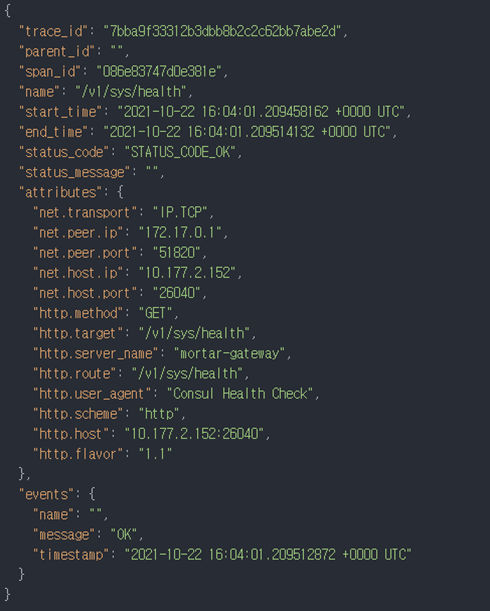
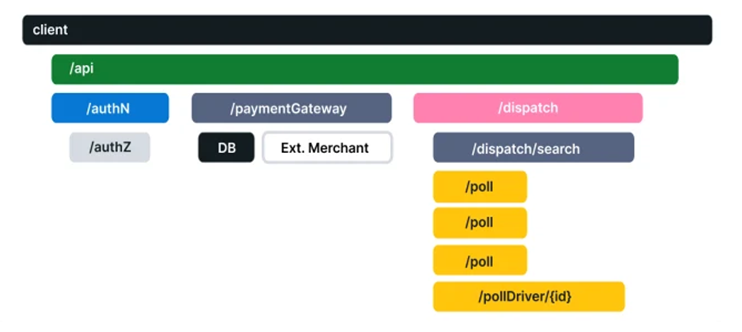

# 1. 관측 가능성

### 관측 가능성이란 무엇인가?

관측 가능성의 정의는 <b>`시스템에서 외부로 출력되는 값만을 사용해서, 시스템의 내부 상태를 이해하고 예측하는 것`</b>이다.

관측 가능성(Observability)이란 시스템이 외부로 출력하는 데이터를 통해 내부 상태를 이해하고 예측하는 능력을 의미. 
MSA 구조의 시스템이 대두됨에 따라 복잡한 시스템의 분석이 필요해짐.

이는 단순히 시스템의 상태를 모니터링하는 것에 그치지 않고, 시스템 내부에서 무슨 일이 일어나는지를 더 깊이 파악하고 문제 발생 원인을 식별하는 것을 목표.
이에 따라 블랙박스 모니터링 ( 시스템 메트릭 등 )뿐만이 아니라 화이트박스 모니터링을 포함 한다.
o11y는 빠르게 변하고 있기 때문에 유연한 Arch를 설계해야한다.

**가시성**
인프라와 네트워크에서 발생하는 이벤트를 지칭

o11y와 가시성은 다른 범주이지만 상호보완하며 밀접하게 영향을 끼칠 수 있다.

**구성 요소**
1. 메트릭 : 일정 시간 동안 측정된 데이터를 집계하고 수치화. 전체적인 시스템의 상태를 보고하는데 유용
2. 로그 : 애플리케이션 실행 시 생성되는 텍스트 라인.
3. 추적 : 트랜잭션을 처리하는 과정에서 발생하는 세부적인 정보

# 2. 메트릭

### 가용성
- SLI(Service Level Indicator): 서비스 수준 지표
- SLO(Service Level Objective): 서비스 수준 목표
- SLA(Service Level Agreement): 서비스 수준 협약

SLI는 SLO를 달성해야함. SLO는 SLA보다 보수적인 추정치로 설정. 

### 구글의 골든 시그널
주로 네트워크에서 발생하는 이벤트와 많은 연관성이 있고, 중요한 것에 집중하기 위한 가이드라인

1. 지연
지연과 에러를 구분할 필요가 있음.
지연의 경우 명확한 기준을 세워서 (ex. 60초 timeout) 에러로 관리해야한다.

2. 에러
에러의 기준은 명확히 설정해야한다. 
서버 내부 에러일 경우 HTTP 500일 수도 있지만, 개발자에 따라 HTTP 200 응답에 세부 에러 내용을 Body에 실어서 Return할 수 있기 때문.

3. 트레픽, 포화
트레픽은 발생하는 요청의 양을 뜻함.
트레픽이 많아 포화 상태가 되면 지연과 에러가 발생하여 최종적으로는 *장애*가 발생한다.

지연의 증가는 종종 포화의 선행 지표가 되기도 한다.

`골든 시그널의 원칙은 트래픽 증가에 따른 지연과 에러를 최소화하고 최종적으로 장애에 이르지 않도록 설계`하는 것이다.

### 메트릭 유형 
일반적으로 메트릭에는 카운터, 게이지, 요약, 히스토그램의 네 가지 유형이 있다.

1. 카운터: 이벤트의 누적 개수 혹은 크기를 표현
2. 게이지: 증가하거나 감소하는 임의의 값을 나타내며, 즉, ‘현재 상태’.
3. 요약: 측정한 이벤트의 합계와 카운트.
4. 히스토그램: 데이터의 분포도와 시간 경과에 따른 추세.

### 시계열 데이터
o11y에서는 주로 시계열 데이터를 다룬다. 이러한 데이터를 차트로 표현하고 시각화할 때 적합한 차트 형식은 히스토그램.

### 메트릭 관리 방안
1. 일관된 메트릭 표준을 준수.
2. 태그와 레이블을 활용하여 상황 정보를 포함 시켜야 함.
3. 서로 상관 관계를 가지는 데이터를 대시보드에 구성하고, 서비스 플로우 대로 차트 구성이 좋음.
4. 사용자 유형을 나누어 필요에 따라 각기 다른 기준을 가지고 판단한다.

# 3. 추적

### 추적구성요소

**추적**(**tracing**)은 시스템 내에서 하나의 요청이 여러 마이크로서비스와 구성 요소를 경유하며 처리되는 전체 경로를 파악하는 과정.
주로 마이크로서비스 아키텍처와 같이 분산된 시스템에서, 각 요청이 다양한 서비스와 인터페이스를 거치며 발생하는 문제를 파악하고 성능을 모니터링하는 데 활용

1. Trace ID (추적 ID): 하나의 요청이 시작될 때 생성되는 고유 식별자입니다. 이 식별자를 통해 모든 관련 요청을 추적할 수 있습니다.

2. Span (스팬): 추적 데이터에서 각 서비스가 처리한 작업 단위를 의미합니다. 한 요청 내에서 각 작업은 별도의 스팬으로 기록되며, 스팬마다 고유한 ID를 가집니다. 각 스팬은 시작 시간, 종료 시간, 서비스 이름, 요청 경로 등의 메타데이터를 포함합니다. 아래의 그림과 같은 구조로 되어 있다.

3. Span ID (스팬 ID): 각 스팬의 고유 식별자입니다. 스팬 ID는 상위 스팬(Parent Span)과 연결되어 있어, 요청이 여러 서비스와 시스템을 통과하는 동안의 계층 구조를 형성합니다.

4. Parent-Child 관계: 각 스팬은 부모-자식 관계로 연결되며, 하나의 요청이 여러 작업으로 나뉘어 진행되는 과정을 계층 구조로 나타냅니다. 이를 통해 하나의 트랜잭션이 여러 작업을 거쳐 처리되는 과정을 시각화할 수 있습니다.
 

### APM과 차이점
Application Performance Management(APM)는 애플리케이션의 성능을 측정하고 관리하는 데 초점을 둡니다. 반면, Tracing은 분산 시스템의 요청 흐름을 세부적으로 파악하여 시스템의 문제를 진단하는 데 중점을 둡니다. APM은 시스템 전반적인 상태를 개괄적으로 모니터링하는 데 유용하고, Tracing은 특정 요청의 흐름을 상세히 분석하는 데 적합합니다.

# 4. 로그

### 로그 관리
로그를 관리하는 목적은 MSA로 분포되어 있는 각 모듈들의 로그들을 중앙 집권형으로 보고 싶어서 관리한다. 하지만 각 모듈별로 프레임워크와 형식이 다르기 때문에 다양한 로그 유형을 표준화하여야하고 쉽게 검색이 가능할 수 있도록 가공해야한다.

**로그**(**log**)는 애플리케이션 실행 시 생성되는 텍스트 라인으로 구조적인 JSON 형식이나 비구조적인 텍스트 형식으로 출력된다. 로그는 애플리케이션 에러와 경고를 확인하고, 문제점에 대한 정확한 원인을 이해하기 위해 필요하다.  
로그 파일(엔트리)에 명시되어야 하는 중요한 정보에는 타임스탬프, 식별자, 소스, 레벨 또는 카테고리가 있다.

### 로그에 포함할 유용한 정보
- 타임스탬프: 마이크로세컨드 및 GMT/UTC 시간대로 수집 권장 (글로벌 서비스일 때의 TZ Issue, Cloud 사용시 Locale 이슈)
- 식별자: 가능한 많은 고유 식별자 (Join으로 다양한 인과관계 분석 가능)
- 소스: 호스트(Host), 클래스(Class), 모듈, 함수 파일명(filename, code line) 등 디버깅에 도움.
- 레벨 또는 카테고리: 로그 레벨에는 ERROR, DEBUG, INFO, WARN

# 5. LGTM의 상관관계

### 상관관계의 필요성

이러한 수집된 데이터들이 더 유의미해지기 위해서는 **JOIN**을 통해 데이터의 효용 가치가 증대된다.

### 예시
로그 + 로그 + ... + 로그 => (Counting, Grouping) -> **메트릭**

로그 + 로그 + ... + 로그 => (Event time + Event ID Join) -> **Tracing**
