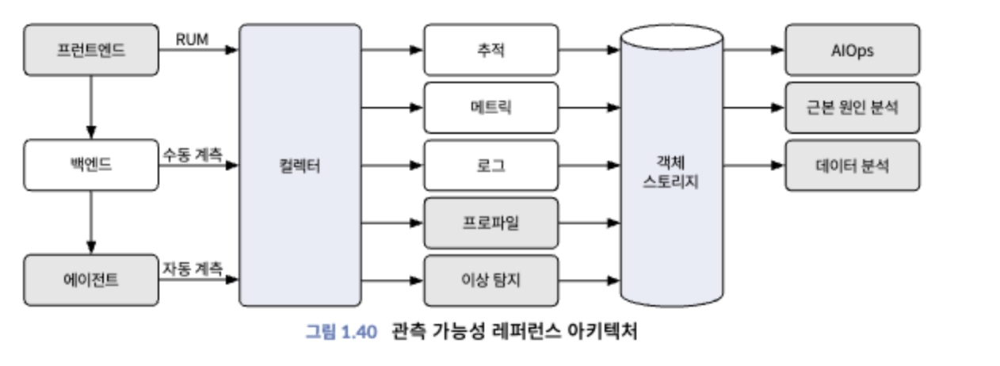
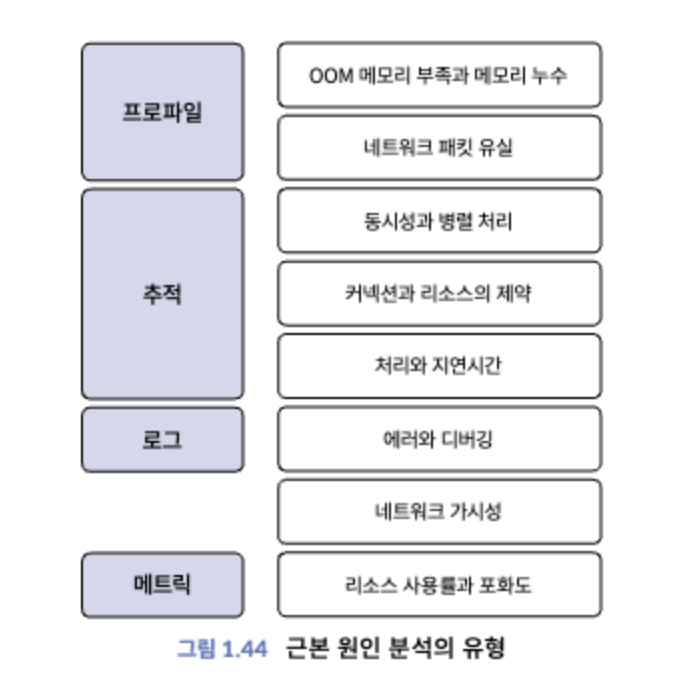

# Chapter 1

## Observability?

"시스템에서 외부로 출력되는 값만을 사용해서 시스템의 내부 상태를 이해, 예측하는 것"

- Monitoring: 시스템의 상태를 확인하는 것
- Observability: `metric`, `log`, `tracing` 을 활용하여 System/Application의 `Context`를 제공하는 것
- Visibility(author's opinion): Infra/Network Level에서 troubleshooting

## Components of Observability

- Metrics: "일정 시간" 동안 측정된 데이터를 집계하고 수치화한 것.
- Logs: System/Application의 "이벤트"를 기록한 것
- Tracing: Information of procedures in transaction
  - metadata: context(cause of latency, error, bottleneck, etc), logs, tags
  - Can trace with Jaeger

## Kind of Metrics

- Availability
  - Quantify as SLI(Service Level Indicator)
    - ex) Response time of API is 200ms
  - SLI should achieve SLO(Service Level Objective)
    - ex) 99.9% of API response time should be less than 200ms
  - SLO should lower than SLA(Service Level Agreement)
    - ex) If Service Availability is under 99.9%, we should pay penalty  

- Google's Golden Signals
  - Latency
  - Error
  - Traffic
  - Saturation : "Utilization" of resources (CPu, Memory, Disk, etc)

## Type of Metrics

- Counter: Number/Size of events
  - for something cumulative things
- Gauge: Value of increase/decrease of something.
- Summary: Like DB's summary
- Histogram

## Time Series Data

- Should express time series data with chart(Grafana, Loki, Prometheus)
- Can extract correlation between metrics and logs

## Bucket

- Time Series Data is divided into buckets(specific range)

## Metric Management Technique

- Concentrate on "What is important for domain/service" like response time, error rate.
- Consider correct range of unit (service by service, domain by domain)
- Use `Tag` to include situation in metrics.

## Tracing

>A method of tracking the actions taken by a request as it passes through each component in a `distributed system`(especially _**micro service system**_).  
>It plays a particularly important role to visualize the overall flow of a single request as it passes through multiple services and APIs, and to identify the source of bottlenecks or delays.

### Span

- A specific part of how an action or request is performed within a system.
- Records information from the time a request is initiated to the time it is completed, giving you a detailed view of how the entire request moves through the system and is processed.
- `span context` is used to pass information between spans.
- `span reference` is used to link spans.
- `baggage` is sharable data between spans(in header)
- `context propagation` is a way to spread context between services.
  - include `trace id`, `span id`, `metadata`

## Log

Should include below items

- timestamp
- identifier
- source
- level/category (General categories as ERROR, INFO, DEBUG, WARN)

## Instrumentation

Additional code/tool to monitor system/application deeply.

- User custom code
- Use APM or Tracing tool (Datadog, NewRelic, Jaeger, OpenTelemetry, Exporter, etc)

## Reference Architecture of Observability

- frontend collector : RUM
- backend collector : Manual Instrumentation
- agent collector : Automatic Instrumentation

## Open Source Tools

- OpenTelemetry : Library for Instrumentation for telemetry data
- Loki : Log Management System for Grafana
- Grafana Mimir : Storage for Prometheus
- Thanos : Tool for multi-cluster Prometheus
- Jaeger : Tracing tool
- Grafana Tempo : Tracing tool for Grafana
