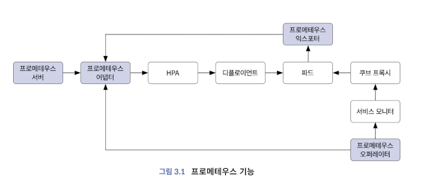
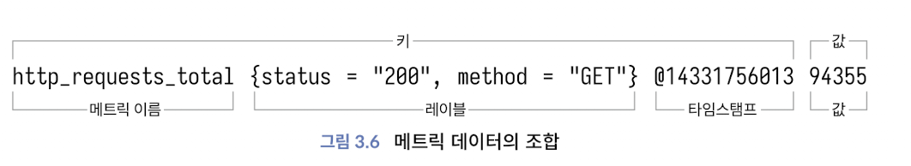
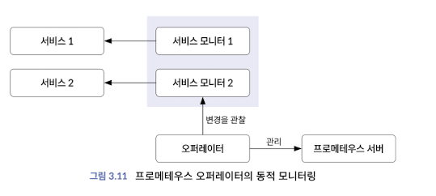
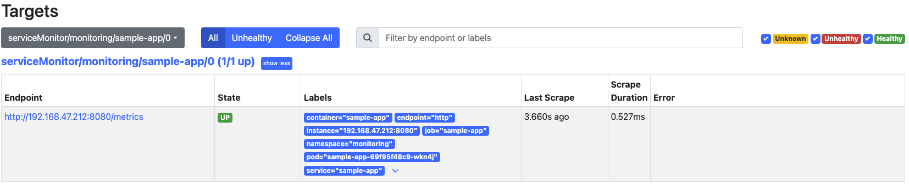
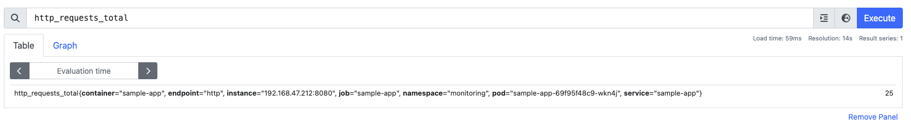

*본 문서는 도서 [모니터링의 새로운 미래 관측 가능성](https://www.google.co.kr/books/edition/%EB%AA%A8%EB%8B%88%ED%84%B0%EB%A7%81%EC%9D%98_%EC%83%88%EB%A1%9C%EC%9A%B4_%EB%AF%B8%EB%9E%98_%EA%B4%80%EC%B8%A1/vJf7EAAAQBAJ?hl=ko&gbpv=0)를 참고하여 작성되었습니다.* 
# 관측 가능성의 시작, 프로메테우스
## 프메테우스 바이너리 구성
- 프로메테우스의 기능: 운영자를 위한 메트릭 모니터링, 개발자를 위한 익스포터, 오스케일링 설정, 시계열 데이터베이스, 서비스 모니터를 사용한 서비스 디스커버리, 알람과 업무 규칙


<details>
    <summary>프로메테우스 오퍼레이터</summary>
    <div markdown="1">
        <ul>
            <li>k8s에서 프로메테우스를 구성할 때 자원 관리와 프로비저닝 수행</li> 
            <li>쿠버네티스 내서 동적으로 증가하는 서비스와 파드 발견</li>
            <li>서비스와 파드의 증감을 모니터링하며, 증감 발생 시에 프로메테우스 구성 파일 업데이트</li>
        </ul>
</details>
<details>
    <summary>프로메테우스 익스포터</summary>
    <div markdown="1">
        <ul>
            <li>특정 메트릭을 수집해서 엔드포인트에 노출시키는 소프트웨어 혹은 에이전트</li> 
        </ul>
</details>
<details>
    <summary>프로메테우스 어댑터</summary>
    <div markdown="1">
        <ul>
            <li>커스텀 메트릭이 익스포터를 통해 제공되면 프로메테우스 서버가 이를 수집</li> 
            <li>복잡한 커스텀 메트릭을 측정하고, Horizontal Pod Autoscaler를 통해 pod 오토스케일링 </li> 
        </ul>
</details>

### 프로메테우스 라이프 사이클
- 메트릭을 수집하고 시계열로 저장 
- 메트릭을 측정하고 리소스를 오토스케일링 
- 변경된 리소스를 자동으로 디스커버리 
- HPA와 연계해 증가한 리소스로 유저 트래픽 분해

### 노드익스포터가 OS시스템 메트릭 데이터를 수집하고 프로메테우스 DB에 저정하는 과정 
1. [프로메테우스](https://prometheus.io/download/) 설치 
2. 압축해제 

```sh
# Install Prometheus 
wget https://github.com/prometheus/prometheus/releases/download/v3.0.0/prometheus-3.0.0.linux-amd64.tar.gz

tar xvzf prometheus-3.0.0.linux-amd64.tar.gz

sudo useradd --no-create-home --shell /bin/false prometheus
sudo mkdir /etc/prometheus
sudo mkdir /var/lib/prometheus
sudo chown -R prometheus. /etc/prometheus
sudo chown -R prometheus. /var/lib/prometheus
sudo cp prometheus-3.0.0.linux-amd64/prometheus  /usr/local/bin/
sudo cp prometheus-3.0.0.linux-amd64/promtool  /usr/local/bin/
sudo chown prometheus. /usr/local/bin/prometheus
sudo chown prometheus. /usr/local/bin/promtool
cd /etc/prometheus

# Install Node Exporter
wget https://github.com/prometheus/node_exporter/releases/download/v1.8.2/node_exporter-1.8.2.linux-amd64.tar.gz
```

## 프로메테우스 시계열 데이터베이스
### 데이터 형식


- http_requests_total 메트릭
    - status 종류: 200,400,500 &rarr; 3개
    - method 종류: GET, Prometheus &rarr; 2개

    3 X 2 = 6개 시계열 데이터
#### 메트릭에서의 카디널리티
- 전체 행에 대한 특정 칼럼의 중복 수치를 나타내는 지표로 프로메테우스 서버가 스크래핑을 결정하는 기준 
### 데이터 관리
#### 프메테우스의 Time Series Database
- LRU 알고리즘(가장 오랫동안 참조하지 않은 페이지 교체) 사용
- 메모리 페이징(프로세스를 일정 크기인 페이지로 분할하여 메모리에 적재) 
- 샘플을 수집하고 블록 형태로 만들어 디스크에 저장
- Data set은 다수 데이터 그룹을 의미하며 데이터 포인트는 대시보드에서 시계열로 출력되는 개별 데이터를 지칭 

### 블록 관리
#### 샘플: 시계열 데이터로 수집된 데이터 포인트로 시계열의 수치를 나타냄
- float64값과 타임스탬프로 구성됨
#### 블록 생성
- 프메테우스 데이터 포인트는 일정한 시간 간격으로 수집
- 데이터를 그래픽 형식으로 표현할 때 x축은 시간이고 y축은 데이터 값이며 일반적으로 시간에 따른 데이터의 변화를 표시
#### 블록 병합
- 파일과 디스크에 민감한 시스템에서는 파일의 개수와 크기를 적절히 유지하기 위한 **블록(파일)의 병합**이 필요
- `--storage.tsdb.min-block-duration`: 하나의 블록에 저장된 데이터의 시간 의미 
- `--storage.tsdb.max-block-duration`: 하나의 블록에 최대로 저장할 수 있는 시간 의미 
#### 프로메테우스 로컬 스토리지: 프로메테우스에 데이터를 저장하는 표준 방법 
#### 데이터 흐름: 세 단계를 거쳐 수집된 데이터를 로컬에 저장
1. 메모리&rarr; 반복적인 디스크 쓰기 방지
- 최대 두시간동안 메모리에 보관 
- 하나 이상의 데이터 청크 포함 
- 디스크 IO를 절반 이상 크게 줄임 
2. 로그 선행 기입
- 메모리 내 데이터의 상태를 유지함으로써 프메테우스가 충돌 or 재시작하면 이를 재생
- 백업, 복구 기능을 구현하기 위해 로그 선행 기입을 사용
3. 디스크
- 두시간이 지나면 청크가 디스크에 기록 
- 디스크와 청크는 동일하게 일대일로 대응 
## 프로메테우스 쿠버네티스 구성 
- kube-prometheus: 리소스를 생성하기 위한 프로메테우스 오퍼레이터와 커스텀 메트릭을 지원하는 어댑터를 포함


```
# 쿠버네티스 환경 구축 (EKS)
$ eksctl create cluster --name prometheus --region ap-northeast-2
$ kubectl get nodes -o wide

# 오퍼레이터 설치
$ git clone https://github.com/prometheus-operator/kube-prometheus.git
$ cd kube-prometheus
$ k create -f manifests/setup 
$ k create -f manifests/  
$ k get crd -n monitoring 

# 포트포워딩
$ k -n monitoring port-forward svc/prometheus-k8s 9090
Forwarding from 127.0.0.1:9090 -> 9090
Forwarding from [::1]:9090 -> 9090

$ k -n monitoring port-forward svc/alertmanager-main 9093
Forwarding from 127.0.0.1:9093 -> 9093
Forwarding from [::1]:9093 -> 9093

```

## 프로메테우스 오퍼레이터
&rarr; 오퍼레이터의 사용을 통해 프로메테우스 서버를 자동으로 변경하고 타깃으로부터 메트릭 수집을 자동화
- 프로메테우스 오퍼레이터는 수준 높은 다양한 기능과 자동화 기능을 제공
    - 서비스 모니터를 다수 생성해서 멀티 클러스터 등의 복잡한 런타임 환경에 대응하도록 구성
    - 쿠버네티스를 제외한 다른 리소스의 경우 콘솔 서비스 디스커버리를 사용하는 것을 권장
- 프로메테우스 오퍼레이터의 서비스 모니터와 파드 모니터는 서비스의 파드의 지속적인 모니터링을 통해 자동화 
### 서비스 모니터
- 서비스를 모니터링하는 방법을 선언적으로 정의 가능 
- k8s 내 애플리케이션을 모니터링하려면 엔드포인트(기본적인 IP 주소 목록)가 있어야 함 
- k8s svc는 레이블 셀렉터로 파드를 발견하고 이를 엔드포인트에 추가 &larr; 프로메테우스 오퍼레이터 서비스 모티너는 차례로 해당 엔드포인트를 검색하고 파드를 모니터링 

- 프로메테우스에서 확인해야하는 화면은 서비스 디스커버리, 타깃, 메트릭 

### sample-app
1. [sample-app](./sample-app)에있는 Deployment, Service, ServiceMonitor 생성

    ```bash
    $ k apply -f deploy.yaml -n monitoring
    deployment.apps/sample-app created
    $ k apply -f service.yaml -n monitoring 
    service/sample-app created
    $ k apply -f monitor.yaml -n monitoring
    servicemonitor.monitoring.coreos.com/sample-app created
    $ k get pods -n monitoring
    ...
    sample-app-69f95f48c9-wkn4j           1/1     Running   0          117s
    ``` 
2. 타깃에서 추가된 엔드포인트 확인

3. Graph에서 `http_requests_total` 확인


## 프로메테우스 오토스케일링
### 프로메테우스 어댑터
```
# minikube 환경 구축
$ minikube start --vm-driver=docker --kubernetes-version v1.20.0 --memory=12000 --cpus=4

# 네임스페이스 생성
$ k create ns monitoring

# 오퍼레이터 설치

# 설치된 파드 확인 

# 포트포워딩 구성

```