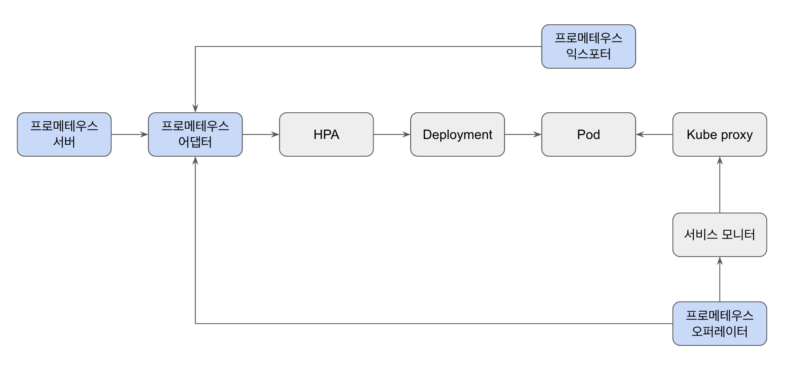
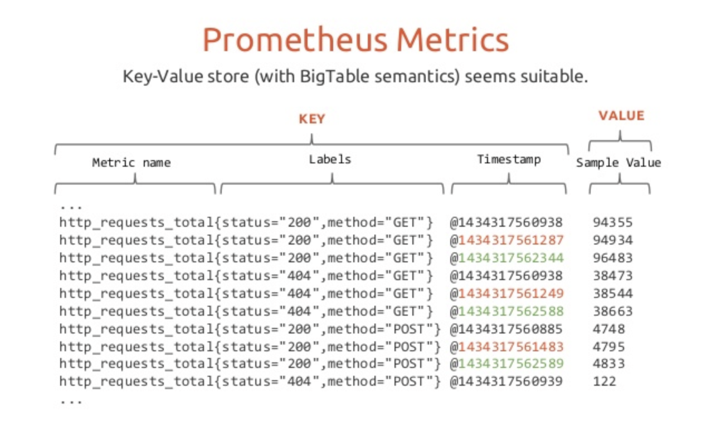

# Ch 3 : 관측 가능성의 시작, 프로메테우스


## 3.1 프로메테우스 바이너리 구성


### 쿠버네티스 & 프로메테우스
- 쿠버네티스
  - 클라우드 네이티브 구현을 위한 핵심 소프트웨어
  - 애플리케이션을 포함한 컨테이너를 운영하고 스케쥴링하는 역할
- 프로메테우스
  - 쿠버네티스를 운영하고 관리하기 위한 소프트웨어
  - 쿠버네티스 기반의 어플리케이션이 원활하게 돌아가도록 다양하고 복잡한 역할


### 프로메테우스의 기능
- 메트릭 모니터링
- 익스포터
- 오토스케일링 설정
- 시계열 데이터베이스
- 서비스 모니터를 사용한 서비스 디스커버리
- 알람과 업무 규칙




### 프로메테우스의 라이프 사이클
1. 메트릭을 수집하고 시계열로 저장
2. 메트릭을 측정하고 리소스를 오토스케일링 처리
3. 변경된 리소스를 자동으로 디스커버리
4. HPA와 연계해 증가한 리소스로 유저 트래픽을 분배


---


## 3.2 프로메테우스 시계열 데이터베이스

### 데이터 형식
**익스포터**가 ```/metrics``` 경로를 통해 다음과 같은 데이터를 제공하면, **프로메테우스 서버**는 ```pull 방식```으로 **익스포터**에서 그 데이터를 수집(스크래핑)하여 ```시계열 데이터베이스```에 저장



#### 카디널리티 폭발
> **카디널리티** : 전체 행에 대한 특정 칼럼(고유 시계열)의 중복 수치를 나타내는 지표
> 
> **고유 시계열 기준?**
> - 메트릭의 이름과 연관된 레이블의 이름/값의 조합

- 프로메테우스 서버는 특정 칼럼에 대한 인덱싱을 통해 스크래핑을 진행
  - Problem : 높은 카디널리티 → 처리해야하는 데이터 과다 → 성능 이슈
  - Solution : 로그 기반 시스템에서 처리


### 데이터 관리
> 프로메테우스 데이터베이스 = TSDB(시계열 데이터베이스)

#### 프로메테우스 TSDB의 특징
- LRU 알고리즘 : 오랫동안 참조하지 않은 페이지를 교체하는 기법
- 메모리 페이징 : 프로세스를 일정 크기인 페이지로 분할해서 메모리에 적재하는 방식
- 샘플(청크; 데이터)을 수집하고, 블록(다수의 청크 + 인덱스 + 기타 데이터) 형태로 만들어 디스크에 저장
  - 인덱스 : 데이터의 위치와 참조에 대한 정보 + 데이터를 빠르게 조회할 수 있는 기능 제공
- 데이터셋 = 다수의 데이터 그룹
- 데이터 포인트 = 대시보드에서 시계열로 출력되는 개별 데이터