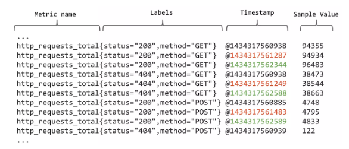

# 3. 관측 가능성의 시작, 프로메테우스

## 프로메테우스 바이너리 구성
프로메테우스는 2012년 시작되었고, 독립적으로 개발되고있는 오픈소스이다.
Prometheus는 클라우드 네이티브 환경에서 정말 중요한 역할을 하고 있다는것 그리고 Kubernetes와 Prometheus는 긴밀하게 연계되어 있다는걸 추측해볼 수있다. 

프로메테우스는 프로메테우스 자체 서버 외에도 프로메테우스 생태계를 구축하고있다. 
여기에서는 프로메테우스 서버자체가 아니라 생태계에 포함된 Exporter, Operator, Adapter를 소개한다.

### 프로메테우스 기능 
1. 다차원 데이터 모델
    - 시간 시리즈 데이터를 다루며, 각 데이터는 메트릭 이름과 키/값 쌍으로 식별됩니다.
(이 부분은 뒤에서 자세히 설명함).
2. PromQL
    - 프로메테우스의 데이터 모델을 활용하기 위한 유연한 쿼리 언어입니다.
3. 분산 스토리지에 의존하지 않음
    - 개별 서버 노드가 독립적으로 동작합니다.
4. 시간 시리즈 데이터 수집
    - HTTP 기반 풀(Pull) 모델을 사용하여 데이터를 수집합니다.
5. 푸시 모델 지원
    - 데이터를 푸시할 때는 중간 게이트웨이를 통해 지원합니다.
6. 대상 서비스 검색
    - 서비스 디스커버리 또는 정적 구성을 통해 모니터링 대상을 자동으로 찾습니다.
7. 그래프와 대시보드 지원
    - 데이터를 시각화할 수 있는 여러 모드의 그래프 및 대시보드를 제공합니다.
 

### 프로메테우스 주요 컴포넌트
Prometheus는 다양한 도구를 통해 거의 모든 유형의 인프라와 어플리케이션을 모니터링하고 운영 자동화 기능을 사용할 수 있다.
이를 위한 몇가지 중요한 부분을 살펴본다.

- Prometheus Operator
1. Kubernetes 환경 내에서 Prometheus의 배포와 관리를 자동화할 수있다. 
2. Prometheus Operator의 Service Monitor와 Pod Monitor를 통해 Kubernetes 서비스 디스커버리 기능을 제공한다.
3. 서비스와 파드의 증감을 모니터링 하며, 증감 발생 시 프로메테우스 구성파일을 업데이트 한다. 

- Prometheus Exporter
1. Exporter는 Prometheus가 직접적으로 메트릭을 수집할 수 없는 다양한 소스로부터 메트릭을 수집하여 Prometheus가 이해할 수 있는 형식으로 변환하는 역할을 한다.
2. 기본적으로 제공하는 Exporter가 존재하며, 그 외에도 커스텀 메트릭 개발을 위한 API,SDK를 제공한다.
- Prometheus Adapter
1. Adapter는 주로 Kubernetes 환경에서 Prometheus에서 수집한 메트릭을 사용하여 Kubernetes의 자동 스케일링 기능(예: Horizontal Pod Autoscaler, HPA)과 연동하는 역할을 한다. Prometheus의 메트릭을 Kubernetes의 Custom Metrics API를 통해 사용할 수 있도록 변환하는 중간자 역할을 수행한다.

## 프로메테우스 시계열 데이터베이스

### 데이터 형식
Prometheus Exporter가 /metrics 경로를 통해 데이터를 제공하면, prometheus 는 pull방식으로 데이터를 수집하여 시계열 데이터베이스에 저장한다.


이 데이터 형식을 보면, http_requests_total 이라는 metric이름으로 여러 레이블이 있다.
status 레이블은 "200", "400", "500" 등의 값이 있을 수 있고, method 레이블은 "GET", "POST"값을 가질 수 있다고 가정할 때 Prometheus는 각각의 레이블 조합에 대해 별도의 시계열 데이터를 생성한다.

여기에서 중요한 개념이 카디널리티이다.

- 카디널리티란?
  > 특정 메트릭에 대해 고유한 레이블 조합의 총 수를 말한다.

  > 예를 들어 http_requests_total 메트릭에 대해 status와 method 라벨이 각각 세 가지와 두 가지 가능한 값을 가질 수 있다고 할 때, 최대 카디널리티는 6(status의 3개 값 × method의 2개 값)이며, Prometheus에 의해 별도의 시계열로 관리된다.
- 카디널리티가 왜 중요한가?
  > 각 시계열 데이터를 관리하는 데 필요한 리소스와 시스템의 성능에 영향을 미친다.

  > 메트릭에 수업이 조합된 여러 차원은 프로메테우스에서 소위 카디널리티 스파이크를 야기할 수있다.
 

### 데이터 관리
Prometheus에서 스크래핑 된 데이터는 데이터베이스에 저장된다.
프로메테우스에서 시계열 데이터에 어떻게 저장하고 관리하는지 확인해보자.

프로메테우스 Time Series Database(TSDB)는 시계열 데이터베이스이며 이런 특징이 있다.

- 프로메테우스 TSDB특징
1. LRU 알고리즘을 사용하여, 가장 오랫동안 참조하지 않은 페이지를 교체한다.
2. 메모리 페이징(paging)을 사용하는데, 일정 크기인 페이지로 분할해서 메모리에 적재하는 방식이다.
3. 수집된 데이터(앞으로는 chunk 라는 용어로 부른다)는 블록형태로 만들어 디스크에 저장한다. 
4. 블록은 다수의 펑크를 포함하여 인덱스 등의 데이터로 구성된다. 인덱스는 데이터의 위치와 참조에 대한 정보 뿐만 아니라 데이터를 빠르게 조회할 수 있는 기능을 제공한다.
데이터셋은 다수 데이터그룹을 의미하며, 데이터 포인트는 대시보드에서 시계열로 출력되는 개별 데이터를 말한다.

프로메테우스 데이터 구조 
실제 데이터가 어디에 저장되었는지 보려면 ps로 확인해볼 수 있다. 
- 프로메테우스 스토리지 어디인지 확인하기
```
/prometheus $ ps
PID   USER     TIME  COMMAND
    1 1000     12:09 /bin/prometheus --storage.tsdb.path=/prometheus --storage.tsdb.retention.time=24h (나머지생략)
   77 1000      0:00 /bin/sh
```
- 구조 확인하기
```
/prometheus $ tree
.
├── 01HQ4SP85M2HZ1T160MKJ8ETAX
│   ├── chunks
│   │   └── 000001
│   ├── index
│   ├── meta.json
│   └── tombstones
├── 01HQ53DJWQYFHF0R0W81TP1M51
│   ├── chunks
│   │   └── 000001
│   ├── index
│   ├── meta.json
│   └── tombstones
├── 01HQ57N0M547EXEQF95J3H077B       # 블록 
│   ├── chunks                       # 청크파일
│   │   └── 000001
│   ├── index                        # 색인을 위한 레이블과 시간 인덱스 파일
│   ├── meta.json                    # 블록의 메타데이터
│   └── tombstones                   # 삭제여부 표시 파일
├── chunks_head                      # 청크헤드
│   ├── 000007
│   └── 000008
├── lock
├── queries.active
└── wal                              # wal 파일
    ├── 00000004
    ├── 00000005
    ├── 00000006
    ├── 00000007
    └── checkpoint.00000003          # 복구를 위한 checkpoint wal파일
        └── 00000000
```
[용어 정리]

- 블록(Blocks)

  - Prometheus는 시계열 데이터를 불변의 블록으로 저장한다.
각 블록은 특정 시간 범위의 데이터를 포함하고 있으며, 여기서 01HQ57N0M547EXEQF95J3H077B 같은 디렉토리는 개별 블록을 나타낸다. 

  - 블록의 구성요소

    - chunks: 실제 시계열 데이터 샘플이 저장된 파일이며, 청크 파일(000001 등)은 시간에 따른 데이터 포인트를 압축하여 저장한다.
    - index: 시계열 데이터를 효율적으로 쿼리할 수 있도록 돕는 인덱스 파일이다. 메트릭 이름, 레이블, 타임스탬프 등에 대한 인덱스를 포함하여, 쿼리 시 해당 시계열 데이터를 빠르게 찾을 수 있게 한다.
    - meta.json: 해당 블록의 메타데이터를 포함하는 파일입니다. 블록의 시간 범위, 버전 정보, 블록에 대한 다른 메타데이터 등이 포함되며 사람이 읽을 수 있다.
    - tombstones: 삭제된 시계열 데이터를 표시하는 파일이다. 데이터 삭제 요청이 있을 경우, 실제 데이터는 즉시 삭제되지 않고, 이 파일에 삭제 마크가 표시된다.

- 청크 헤드(chunks_head)

  - 현재 쓰기 작업 중인 시계열 데이터를 저장하는 임시 공간이다.
  - Prometheus는 새로운 데이터 포인트를 먼저 이곳에 저장한 후, 일정 시간이 지나면 불변 블록으로 데이터를 옮긴다.

- WAL(Write-Ahead Logging)
  - wal: WAL은 쓰기 선행 로깅(Write-Ahead Logging)의 약자로, 데이터를 블록으로 옮기기 전에 모든 쓰기 작업을 로깅한다. 이는 데이터 무결성과 복구 메커니즘을 보장하기 위한 것이다.
  - checkpoint.00000003: 체크포인트 파일은 WAL의 특정 시점에서의 스냅샷을 나타낸다.
이는 시스템 재시작 시 WAL의 전체 스캔 없이 빠른 복구를 가능하게 합니다. 프로메테우스에서 장애가 발생해서 메모리에 있는 데이터에 문제가 생기면 WAL를 하용해 메모리에서 관리하는 데이터를 복구한다.
- 기타 파일
  - lock: 동시성 제어와 같은 목적으로 사용되는 락 파일
  - queries.active: 현재 진행 중인 쿼리 정보를 저장하는 파일
 

### 블록관리
- 샘플
샘플(sample)은 시계열 데이터 포인트를 의미하며, 시계열 데이터의 핵심 단위이다.

- 블록 생성
시계열은 시간순으로 인덱싱 되는 숫자데이터 포인트의 시퀀스로 정의할 수 있다.

- 블록 병합
파일의 개수와 파일의 크기를 적절하게 유지하는것이 중요하다.

- 프로메테우스 로컬 스토리지
프로메테우스는 로컬스토리지에 데이터를 저장한다.

## 프로메테우스 쿠버네티스 구성
helm chart로 설치하면 내부 구조를 이해하는게 쉽지 않아, 바이너리를 다운받고, 구성파일을 작성하고 설치하는 방법을 알려준다.

프로메테우스 오퍼레이터 (https://github.com/prometheus-operator/kube-prometheus)를 사용하여 설치한다.

--- 상세 설치는 생략 ---

## 프로메테우스 오퍼레이터
Prometheus Operator의 역할은 Service Discovery, 즉, 동적으로 변하는 쿠버네티스 리소스를 쉽게 탐색하고 검색하는 기능을 제공한다.

프로메테우스의 타깃은 Config파일에서 관리한다, 이때 Configmap또는 별도 파일로 관리하는것은 좋은 방법이 아니다.
 Prometheus Operator를 사용하면 Kubernetes 클러스터 내의 서비스가 동적으로 변경될때 변화를 자동으로 감지하고 Prometheus의 타깃 목록을 업데이트 할 수 있다.

Custom Resource Definitions (CRDs)를 통해 모니터링 하는 방법을 선언적으로 정의하는데, CRDs 중 하나가  ServiceMonitor이다.

- ServiceMonitor: 특정 쿠버네티스 서비스를 모니터링 대상으로 지정하고, Prometheus가 해당 서비스의 엔드포인트를 어떻게 스크래핑할지 세부 사항을 정의한다. 
- PodMonitor: ServiceMonitor와 유사하지만, 서비스 대신 개별 파드를 직접 모니터링 대상으로 지정한다.
- PrometheusRule: 경고 규칙을 정의하여 Prometheus Alertmanager가 사용할 수 있도록 한다.


## 프로메테우스 오토스케일링

### 프로메테우스 어댑터
프로메테우스 어뎁터는 Prometheus에서 수집한 메트릭을 사용하여 Kubernetes의 자동 스케일링 기능(예: Horizontal Pod Autoscaler, HPA)과 연동하는 역할을한다.

하지만 실제로는 어뎁터를 많이 사용하지 않고 KEDA를 많이 사용하는 추세이다.

### KEDA 오토스케일
KEDA(Kubernetes-based Event-driven Autoscaler)는 Kubernetes 워크로드를 이벤트 기반으로 확장할 수 있도록 도와주는 도구

기본 Kubernetes Horizontal Pod Autoscaler(HPA)와 통합하여 동작하며, 애플리케이션이 처리해야 할 이벤트나 메트릭을 기준으로 오토스케일링을 실행

## 프로메테우스 알람
Prometheus 알람은 Alertmanager를 통해 특정 조건에 따라 알림을 생성하고 관리하는 기능. 
이를 통해 시스템의 상태를 지속적으로 모니터링하고, 이상 상황이 발생했을 때 즉각적인 대응이 가능

### 주요 구성 요소
1. 알람 규칙(Alert Rules)

- Prometheus에서 알람을 정의하는 규칙입니다.
- 특정 메트릭에 기반하여 조건이 충족되면 알람을 생성합니다.
- YAML 형식으로 작성하며, Prometheus의 prometheus.yml 파일에 포함됩니다.

2. Alertmanager

- 생성된 알람을 처리하고 알림을 관리하는 도구입니다.
- 알람 그룹화, 중복 제거, 알림 전송 정책 등을 설정할 수 있습니다.
- 이메일, Slack, PagerDuty, Webhook 등을 통해 알림을 보낼 수 있습니다.

3. Alert Expression

- PromQL(프로메테우스 쿼리 언어)을 사용하여 알람 조건을 정의합니다.
- 예를 들어, CPU 사용량이 특정 임계값을 초과하는 경우를 감지.


## 프로메테우스 샤딩
프로메테우스 샤딩은 **수평적 확장(horizontal scaling)**을 통해 대규모 모니터링 환경에서 성능을 최적화하고 관리 효율성을 향상시키기 위해 사용되는 방법. 
샤딩은 데이터를 여러 Prometheus 인스턴스에 분할하여 각각 독립적으로 데이터를 수집, 저장, 쿼리하도록 하는 전략

### 왜 샤딩이 필요한가?
1. 데이터 규모 증가

- 대규모 시스템에서는 수집해야 할 메트릭의 양이 많아져 단일 Prometheus 인스턴스의 처리 한계를 초과할 수 있습니다.
2. 리소스 제약

- 단일 인스턴스에서 너무 많은 데이터를 처리하면 CPU, 메모리, 디스크 IO 등의 리소스가 과도하게 소모됩니다.
3. 고가용성 및 장애 복구

- 샤딩을 통해 데이터를 여러 인스턴스로 분산하면 특정 인스턴스가 장애를 겪어도 전체 모니터링이 중단되지 않습니다.
### 샤딩 방식
1. 타겟 기반 샤딩 (Target-based Sharding)

- **수집 타겟(Scrape target)**을 각 Prometheus 인스턴스에 분배합니다.
예를 들어, 네트워크 장치 그룹, 애플리케이션 서버 그룹 등을 각각의 Prometheus 인스턴스가 관리하도록 분배.
2. 메트릭 기반 샤딩 (Metric-based Sharding)

- 메트릭의 이름이나 라벨(key-value pair)에 따라 데이터를 분할하여 저장.
예를 들어, 특정 라벨(서비스 이름, 지역 등)을 기준으로 데이터를 분리하여 저장.
3. 시간 기반 샤딩 (Time-based Sharding)

- 수집된 데이터를 시간 단위로 분할하여 저장.
특정 시간대 데이터를 다른 인스턴스에 저장하는 방식.
