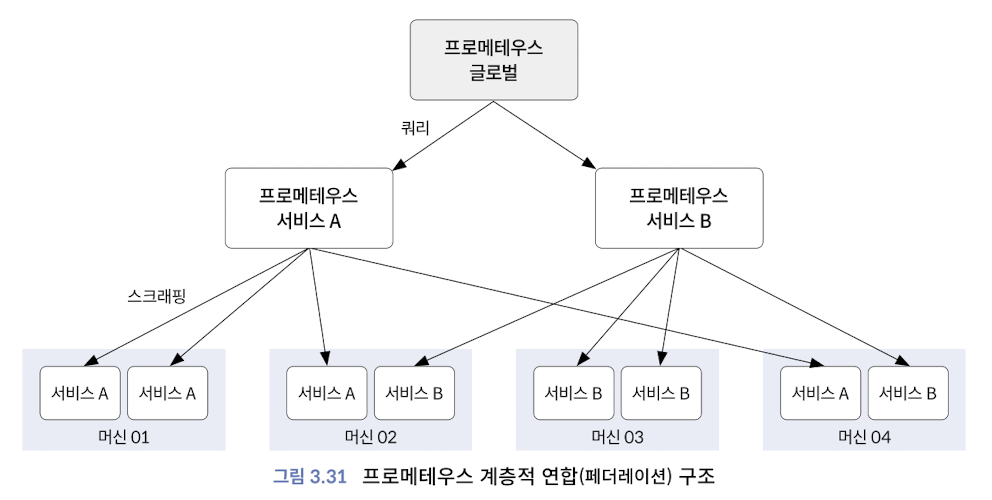

# Chap3. 관측 가능성의 시작, 프로메테우스

## 바이너리 구성

> 클라우드 네이티브의 런타임 플랫폼은 쿠버네티스, 나머지 운영과 자동화에 대한 기능은 프로메테우스를 통해서 구현
> 

**프로메테우스 구성 요소**

프로메테우스 오퍼레이터: Kubernetes 내의 service와 pod 모니터링 

프로메테우스 익스포터: 특정 메트릭을 수집해 엔드포인트에 노출시키는 소프트웨어 혹은 에이전트

프로메테우스 어댑터: 익스포터를 통해 제공된 커스텀 메트릭 수집 및 측정해 오토스케일링 구현

**프로메테우스 라이프 사이클**

1. 메트릭을 수집하고 시계열로 저장
2. 메트릭을 측정하고 리소스를 오토스케일링 처리
3. 변경된 리소스를 자동으로 디스커버리
4. HPA와 연계해 증가한 리소스로 유저 트래픽 분배

## 시계열 데이터베이스

**데이터 형식**

프로메테우스 익스포터가 데이터를 제공 → 프로메테우스 서버가 데이터 수집해 시계열 데이터베이스에 저장

- 카디널리티(cardinality)와 스크래핑
    
    카디널리티
    
    : 모니터링 데이터에서 측정 지표(metric)가 가질 수 있는 고유한 레이블 조합의 수
    
    스크래핑
    
    : 모니터링 시스템이 대상 시스템에서 데이터를 주기적으로 가져오는 작업
    

**데이터 흐름**

1. 메모리: 최신 데이터 배치를 최대 두 시간 동안 메모리에 보관 
    
    ⇒ 디스크 IO 감소 및 쿼리 속도 향상 효과
    
2. 로그 선행 기입 (Write-ahead logging, WAL): 메모리 내 데이터의 상태 유지
    
    ⇒ 백업, 복구 기능 구현
    
3. 디스크: 두 시간이 지난 청크는 디스크에 기록됨

## 오퍼레이터

**프로메테우스 오퍼레이터**

- 서비스와 파드 모니터링
- 프로메테우스 오퍼레이터를 사용해 프로메테우스 서버를 자동으로 변경하고 타깃으로부터 메트릭 수집 자동화
    
    

## 오토스케일링

**프로메테우스 어댑터**

> 어댑터가 API에서 메트릭을 노출하기 위해 수행해야 하는 단계
> 
1. discovery: 사용자 지정 메트릭 API에서 노출하려는 메트릭을 찾는 프로세스
2. association: 특정 메트릭이 연결된 쿠버네티스 리소스 결정하는 방법
3. naming: 어댑터가 사용자 정의 메트릭 API에서 메트릭을 노출하는 방법
4. querying: 하나 이상의 쿠버네티스 개체의 특정 메트릭에 대한 요청을 프로메테우스의 쿼리로 변환하는 방법

**KEDA 오토스케일**

> 프로메테우스 어댑터는 프로메테우스 메트릭만을 측정할 수 있으며, 다른 시스템 메트릭과 직접적으로 연계하는 것이 어려움 ⇒ 현업에서는 KEDA 오토스케일 권장
> 

## 알람

> 프로메테우스 계열의 알람을 사용해 다양한 유형의 알람 기능 개발 가능
> 

**프로메테우스에서의 알람**

1. 규칙 매니저가 평가 주기에 따라 규칙(레코딩 규칙과 알람 규칙)을 정기적으로 평가하고 알람 라이프 사이클 관리
2. 알람 매니저는 생성된 알람을 전달받고 통지로 변환
    
    

**알림 상태**

알림 활성화 이후 아래 세 가지 상태로 변화가 이루어짐

- 활성 상태: 아직 펜딩이나 파이어링 상태가 아닌 정상 상태
- 펜딩: 조건을 만족하는 알람 규칙이 감지되어 알람 준비(active) 상태. 하지만 아직 파이어링되기 전으로 장시간 활성 상태는 아님
- 파이어링: 정의된 임곗값 이상으로 장시간 활성 상태

## 운영 아키텍처

**샤딩 아키텍처**

1. 수직 샤딩: 프로메테우스 서버 기준으로 메트릭 수집
2. 수평 샤딩: 샤드 기준으로 메트릭 수집

**샤딩 아키텍처**

단일 프로메테우스 인스턴스만으로 충분하지 않을 때, 스케일링하기 좋은 출발점은 “스크래핑 작업을 논리적으로 분할한 후, 그룹을 다른 프로메테우스 인스턴스에 할당하는 것”

1. 수직 샤딩
- 프로메테우스 서비스 A: 다양한 머신에 분산된 서비스 A에 대한 메트릭만을 스크래핑
- 프로메테우스 서비스 B: 다양한 머신에 분산된 서비스 B에 대한 메트릭만을 스크래핑

1. 수평 샤딩
- 서비스 A를 스크래핑하기 위해 2개의 샤드(샤드1, 샤드2) 구성

**페더레이션 아키텍처**

트리 구조와 같이 상위 레벨의 역할을 하는 프로메테우스 인스턴스에서 하나 이상의 하위 프로메테우스 서버의 시계열을 스크래핑 및 집계

인프라와 애플리케이션을 좀 더 폭넓게 볼 수 있지만, 소스 프로메테우스에서 타깃 프로메테우스로 대량의 데이터와 메트릭을 가져오는 것은 좋은 방법이 아님

## 타노스 운영

**타노스 아키텍처 배경**

프로메테우스의 한계

- 프로메테우스 확장 후 여러 팀이 서로 다른 요구 사항을 제시하면 유지 관리가 어려워짐
- 서비스로 여러 개의 샤드를 노출하는 경우 문제 발생
- 자유로운 조직 문화를 고려하면 메트릭을 관리하기 위해 다수의 프로메테우스를 설치, 운영해야 하지만 저장 공간과 성능의 한계

⇒ 타노스 아키텍처 등장

**타노스 아키텍처**

사이드카: 프로메테우스 인스턴스의 데이터를 다른 타노스의 컴포넌트에서 사용할 수 있게 함

쿼리어: 수신한 쿼리를 사이드카나 다른 타노스 구성 요소로 분배하는 프로메테우스 호환 가능한 API

**타노스 사이드카 방식**

원격 읽기 방식 사용 (pull과 유사)

한계

- 사이드카 별도의 배포가 필요하고, 파드 라이프 사이클에 영향 미침
- 추가적인 리소스를 사용하므로 운영 비용 증가
- 사이드카는 프로메테우스 파드에 종속적이고, 멀티 테넌트와 같은 복잡한 구성에 제약 받음

**타노스 리시버 방식**

원격 쓰기 방식 사용

타노스 사이드카 방식의 한계 해결