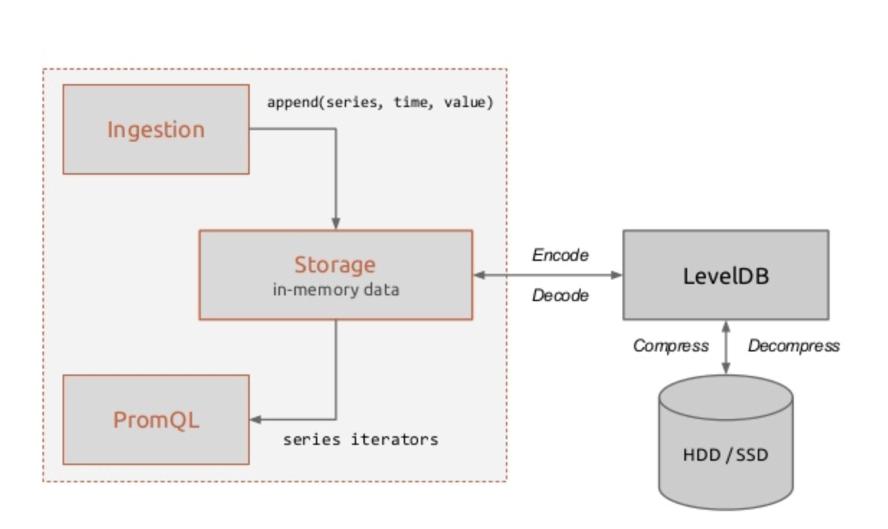
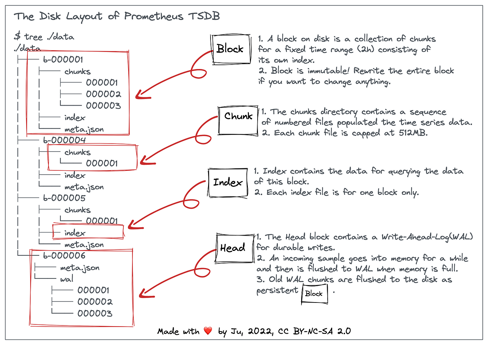
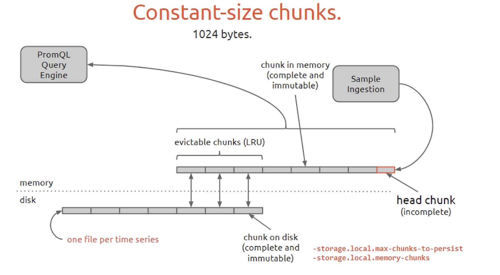

# Chapter 3: Prometheus

## Components of Prometheus

>Author described Prometheus's components concept with combining Kubernetes's components.  
>It makes little bit confusing to understand.

[Architecture](https://github.com/prometheus/prometheus/tree/main?tab=readme-ov-file#architecture-overview)

- **Prometheus Operator**
  - Manages Prometheus's resources, provisioning and etc
  - There are `Service Monitor` and `Pod Monitor` which has `Service Discovery` feature to detect service and pod scaling dynamically

- **Prometheus Exporter**
  - Agent of each node/pod in Prometheus's architecture
  - Inject metrics to Prometheus Adapter
  
- **Prometheus Adapter**
  >Upon [docs](https://prometheus.io/blog/2018/07/05/implementing-custom-sd/#adapter), it's not officially managed component of Prometheus anymore.  
  >Architecture diagram in book has little content error
  - Custom adapter to scrape custom metrics from Prometheus Exporter
  - Better to understand as `Component for extend default Prometheus`

- Lifecycle of Prometheus
  - **Scrape**: Pull metrics from target
  - **Store**: Store metrics in time-series database
  - **Query**: Query metrics
  - **Alert**: Alerting based on query result
  - **Visualize**: Visualize metrics

## Time Series Database

### Prometheus's data format

- **Format**: `metric_name {label1="value1", label2="value2"} timestamp value`
  - key : `metric_name {label1="value1", label2="value2"} timestamp`
  - value : `value`
- **Cardinality**: Number of unique time series
  - High Cardinality: Use lots of labels -> Memory usage, query performance, data in TSDB get increased

### Data Structure

### Data Flow

#### Memory

- Data batch is stored for max 2 hours
- Include at least 1 chunk

#### WAL

- Write Ahead Log for recovery
- Just like general DB's WAL

#### Disk

- After 2 hours, data is stored in disk as chunks
- With LRU algorithm, chunks move to disk.

## Prometheus Operator

### Custom Resource Definition

Define CRD for dynamic monitoring  
This can make Prometheus's configuration changed dynamically

## Prometheus Auto Scaling

It is better to use `KEDA` than `Prometheus Adapter` for auto scaling to consider other metrics not from Prometheus  

[Reference](https://www.metricfire.com/blog/prometheus-metrics-based-autoscaling-in-kubernetes/)

## Prometheus Operation Architecture

Need to avoid high cardinality and high churn rate to prevent performance issue.

### Distribute Architecture

- Functional Sharding
  

- Federation
  

### Thanos

#### Key Limitations of Prometheus

1. Long-term data storage limitations
   - Prometheus uses local storage (TSDB), and it is difficult to keep long-term data due to disk space limitations.
2. Lack of high availability
   - Prometheus is single-instance-centric, and metric collection stops when the server goes down.
3. Difficult to manage multiple clusters
   - Managing multiple Prometheus instances makes it difficult to centrally analyze collected data.

#### Thanos Architecture

1. Long-term Storage
   - Thanos supports long-term storage of Prometheus data by storing it in external object storage (e.g., AWS S3, Google Cloud Storage, Ceph, etc.)
   - Compressing data in Prometheus and backing it up to object storage.

2. High Availability
   - Run multiple Prometheus servers simultaneously and have Thanos centrally consolidate your data.
   - If one Prometheus instance fails, data can still be ingested from other instances.

3. Global Query
   - Consolidates data from multiple Prometheus instances and presents it in a single query interface.
   - Enables data deduplication and consolidated analysis across Prometheus instances.

4. Low Resource Consumption
   - Data is kept in object storage for long periods of time, reducing local disk usage and resource consumption on the Prometheus server.
