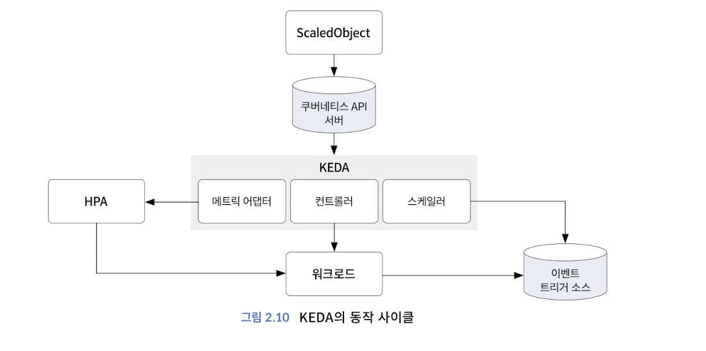

# Chap2. 관측 가능성 기반 기술

## 트래픽 관리

| 마이크로서비스와 동적인 클라우드 환경에서의 관측 가능성만으로는 장애를 극복하기에 충분하지 않으므로, 네트워크 트래픽 데이터도 수집하고 관리해야 함 

**로드밸런서**

**복원성 패턴**

복원성 패턴

: 시스템이 장애나 예외 상황에서도 안정적으로 동작하도록 설계하는 데 도움을 주는 아키텍처 및 설계 전략

서비스 메시를 사용하면 네트워크 구간의 모니터링이 가능하고 복원성 패턴 구현 가능

복원성을 높일 수 있는 패턴

- `재시도` : 장애나 네트워크 문제로 호출이 실패했을 때, 일정 횟수나 시간 간격으로 재시도하는 방식
- `비율 제한` : 들어오는 부하의 비율을 제한해 처리량을 제한하는 방식
- `벌크 헤드` : 다운스트림 서비스를 서로 격리하고 각 서비스의 동시 처리 능력을 제한해 서비스 간에 영향을 미치지 않도록 격리하는 방식
- `서킷 브레이커` : 다수의 마이크로서비스는 서로 호출하는 관계를 가져 장애가 전파될 수 있는데, 서비스 사이에 서킷 브레이커를 넣어 장애 전파를 방지하는 방식

## 쿠버네티스 오토스케일링

**오토스케일링 오픈소스**

1. 메트릭 서버: 각 kubelet으로부터 수집한 리소스 메트릭을 수집하고 집계해 오토스케일링 구현
2. 프로메테우스 어댑터: 사용 가능한 메트릭 검색 > 각 메트릭이 연결된 쿠버네티스 리소스 파악 > 사용자 지정 메트릭 API에 노출하는 방법 파악 > 실제 숫자를 얻기 위해 프로메테우스 쿼리하는 방법 파악
3. KEDA: 이벤트 소스를 모니터링하고 해당 데이터를 HPA에 공급해 리소스를 빠르게 확장

**기본 메트릭**

=> 요청 수, 요청 기간, 동시 요청 수

