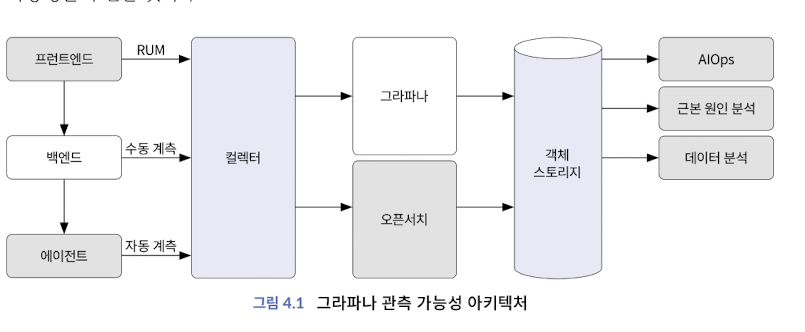
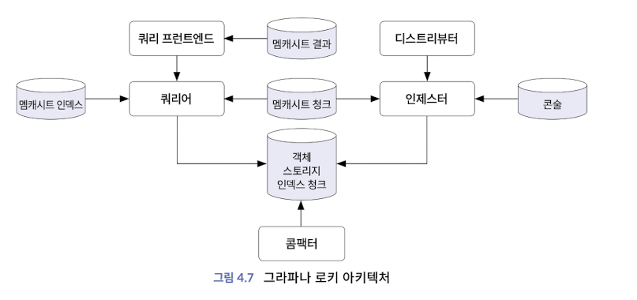

# 오픈소스 관측 가능성, 그라파나
## 그라파나 관측 가능성
### 목적과 범위
- 그라파나: Observability 구현 툴
    - 대중적이고 라이센스에 자유로움
    - 클러스터 구성이 가능하며 많은 API 제공

### 구성 (환경: ubuntu 22.04)
- 환경 구성
1. [ubuntu에 Go 설치](https://minha0220.tistory.com/185)
2. [ubuntu에 helm 설치](https://helm.sh/ko/docs/intro/install/)
3. [ubuntu에 minikube 설치](https://spidyweb.tistory.com/407)
4. helm으로 grafana repo add: `$ helm repo add grafana https://grafana.github.io/helm-charts`
### 어플리케이션 구성
- 다음의 오픈소스를 사용해 어플리케이션을 구성
    * 미니오: 오픈소스 객체 스토리지, AWS S3와 호환, 상세한 메트릭과 수치를 제공
    * 레디스: 가장 대중적인 오픈소스 캐시로 NoSQL 지원
    * 콘술: 서비스 레지스트리 
        - 키-값 유형으로 구성 관리 데이터베이스를 관리
        - 네트워크 로드 밸런서 구성을 관리하고 필요 시 동적으로 변경
    * 카프카: 실시간 스트리밍을 위한 데이터 분석 파이프라인 

- 구성하기
    * [소스 코드](https://github.com/philllipjung/o11ybook/tree/main/4.1)

## 로키 로그 관리
### 로키 기능 

    
로키 마이크로서비스 모드

    

        <ul>
            <li>인제스터</li> 
            <li>디스트리뷰터</li>
            <li>쿼리 프론트엔드</li>
            <li>쿼리 스케쥴러</li>
            <li>쿼리어</li>
            <li>인덱스 게이트웨이</li>
            <li>룰러</li>
            <li>콤팩터</li>
        </ul>

#### 디스트리뷰터
- 일련의 스트림을 수신하면 각 스트림의 정확성이 검증됨 
- 유효한 청크를 배치로 분할하고 병렬로 여러 인제스터에게 전송
- 유효성
    - 들어오는 모든 데이터가 사양에 맞는지 확인하는 유효성 검사 
- 비율 제한
    - 테넌트당 최대 비트 전송률을 기반으로 수신 로그의 속도 제한 
- 포워딩
    - 최종적으로 쓰기를 담당하는 인제스터 컴포넌트에 데이터 전달
- 레플리케이션 팩터
    - 해당 데이터의 레플리케이션 팩터 전달
    - 롤아웃 및 다시 시작하는 동안 중단없이 쓰기를 계속할 수 있도록 하는 것
- 해싱
    - 주어진 스트림을 수신할 인제스터 인스턴스 결정
- 쿼럼 일관성
    - 일관된 쿼리 결과를 보장하기 위해 읽기와 쓰기에 쿼럼 일관성 사용
#### 인제스터
- 쓰기 경로의 장기 스토리지 백엔드에 로그 데이터를 쓰고, 읽기 경로의 메모리 내 쿼리의 로그 데이터 반환
#### 쿼리 프러론트엔드
- 쿼리어의 API 엔드포인트를 제공하는 서비스며 읽기 경로를 가속화하는데 사용 
- 큐잉 메커니즘을 사용한다 

## 미미르 메트릭 관리
### 미미르 기능
- 그라파나 미미르는 병렬 실행과 수평으로 확장 가능한 마이크로서비스가 다수 존재
- 프로메테우스를 통합할 수 있는 메트릭 서버
### 1. 미미르 컴포넌트
#### 쓰기 경로
- **프로메테우스**: 원격 쓰기 API를 사용하여 그라파나 미미르로 푸시 
- **인제스터**: 인제스터로 들어온 샘플은 메모리에 보관되고 로그 선행 기입에 기록
- **콤팩터**: 여러 수집기의 블록을 단일 블록으로 병함하고 중복 샘플 제거
#### 읽기 경로
- 쿼리 프론트엔드: 미미르로 들어온 쿼리는 쿼리 프론트엔드에 입수되고 쿼리를 더 작은 쿼리로 분할
- 쿼리어: 메모리 큐에서 쿼리를 가져오는 작업자 역할을 함 
#### 스토리지 방식
- 각 테넌트의 시계열을 자체 TSDB에 저장함으로써 블록의 시리즈 유지 
- 블록 파일을 저장할 디스크로 객체 저장소(public cloud의 스토리지, 오픈스택 스위프트, 로컬 파일시스템) 필요

### 2. 인덱스 헤더
- 필요한 정보를 얻기 위해 스토어 게이트웨이는 블록에 대한 인덱스 헤더를 만들고 로컬 디스크에 저장

### 미미르 구성

- 프로메테우스 단점
    - 클러스터 구성 지원X
    - 메트릭 데이터 장기간 보관 X
- 타노스 단점
    - 낮은 성능으로 인한 튜닝 필요
    - 구성 복잡
- 미미르
    - 다양한 메트릭과의 연계와 호환성
    - 향상된 쿼리 성능
    - 추가적인 API 제공
    - 헬름 차트, 규칙 등 효과적인 운영 기능 제공

## 템포 추적 관리
### 그라파타 템포 아키텍처
- 템포의 특징
    - 오픈텔레메트리를 포함한 다양한 추적 프로토콜 지원
    - 특정 스토리지에 종속적이지 않고 일반적인 객체 스토리지 지원
    - 메트릭, 로그와 긴밀하게 통합
    - 메트릭 생성기를 사용해서 서비스 그래프와 이그젬플러 생성
- 템포의 컴포넌트
    - 디스트리뷰터: 여러 형식의 스팬 허용 
    - 인제스터
    - 쿼리 프론트엔드: HTTP 엔드포인트를 통해 노출
    - 쿼리어: 수집기 또는 백엔드 저장소에서 요청된 추적 ID 찾는일 담당
    - 콤팩터: 블록을 분석하고 테넌트의 여러 블록을 하나의 최적화된 더 큰 블록으로 압축
    - 메트릭 생성기: Trace에서 메트릭을 파생하고 이를 저장소에 저장

----
### 참고 
- [linux에 Go 설치](https://minha0220.tistory.com/185)

