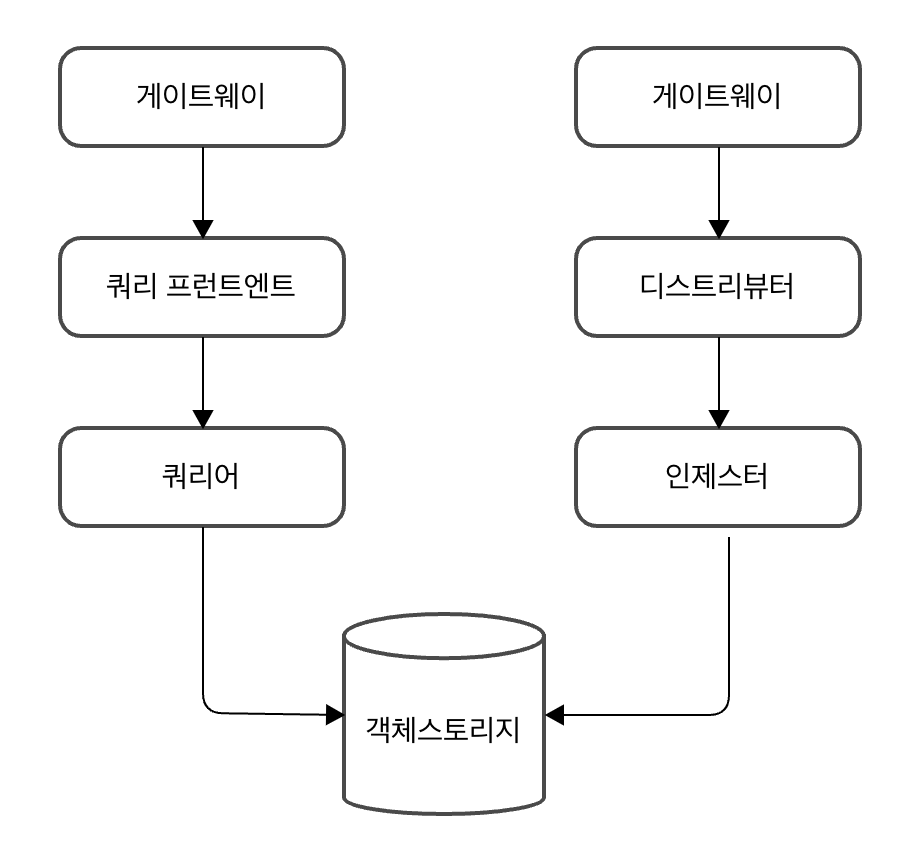
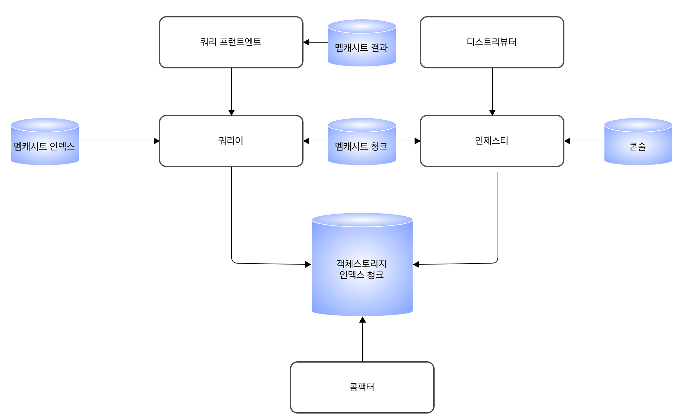

# Ch 4 : 오픈소스 관측 가능성, 그라파나

## 4.1 그라파나 관측 가능성

### 4.1.1 목적과 범위

#### Grafana LGTM 스택
- 로키 : 로그 관리
- 그라파나 : 대시보드
- 템포 : 추적 관리
- 미미르 : 메트릭 관리

#### 그라파나의 장점
- 대중적이고 라이선스에 자유로운 오픈소스
- 지속적이고 장기적인 로드맵과 많은 커뮤니티
- 기술적으로 우수하고 클러스터 구성이 가능하며 많은 API 제공

#### 준비 사항 - 구성 순서
1. 인프라 구성
2. 캐시, 객체 스토리지, 서비스 디스커버리 등 공통적으로 사용하는 애플리케이션 구성
3. 그라파나 관측 가능성 구성

### 4.1.2 인프라 구성
> - 우분투 20.04
> - 미니쿠브 v1.21.0
> - 쿠버네티스 버전 1.20.0
> - 크롬 브라우저
> - Go 1.16.5
> - 헬름 3

### 4.1.3 애플리케이션 구성

#### 미니오
- 오픈소스 객체 스토리지
  - 일반 파일 시스템에 비해서 관리와 구성 측면에서 장점을 제공
- AWS S3와 호환되는 API 제공
  - AWS 운영 환경이라면 _S3_, 클라우드 네이티브 환경으로 다양한 플랫폼을 이용하면 _미니오_ 권장
- 상세한 메트릭과 수치를 제공 → 성능 개선 작업에 GOOD
  - 그라파나 관측 가능성은 디스크 IO에서 가장 큰 성능 감소가 발생하기 때문에, 이를 모니터링하고 성능을 개선하기 위한 튜닝과 작업에 용이

#### 레디스
- 오픈소스 캐시
  - NoSQL 지원
  - 높은 수준의 처리 속도 달성에 GOOD
- 샤딩을 사용해서 클러스터를 구성하고 메모리에서 운영됨
  - 디스크에 비해서 수십 배 빠른 성능
- 쿼리 처리 시에 데이터를 스토리지에서 읽어서 처리하는 것보다, *레디스 캐시에서 읽어서 처리하는 것*을 권장

#### 콘솔
- 오픈소스 서비스 레지스터리
  - HashiCorp에서 관리
  - 키-값 형식의 구성 관리 기능 제공
- 복잡한 네트워크 구성과 구성 정보 관리에 사용
  - 관측 가능성은 단독 서버가 아닌 다수의 서버로 클러스터를 구성하는 것이 일반적이기 때문에 GOOD

#### 카프카
- 오픈소스 데이터 분석 파이프라인
- 카프카 + 카프카 커넥터 조합 : 다양한 시스템에게 안정적으로 데이터 전달 가능
  - 로키에 직접적으로 파이프라인을 생성하는 것보다 권장 (e.g. 로키에서 로그 수집에 사용하는 프롬테일, 플루언트비트)

---

## 4.2 로키 로그 관리

### 4.2.1 로키 기능

#### 로키 마이크로서비스 모드
- 컴포넌트를 개별 마이크로서비스로 실행하여, 마이크로서비스의 개수를 늘려 확장하려는 목적
  - 로키의 컴포넌트는 크게 읽기, 쓰기, 저장 컴포넌트로 구분됨

##### 그라파나 로키 마이크로서비스 모드에서 데이터가 저장되는 흐름

1. 디스트리뷰터 
   - 레플리케이션 팩터 개수를 참고하여, 인제스터로 스트림 전달
     - e.g. '레플리케이션 팩터가 3' => '복제본 3개 생성하도록 스트림 3개 전달'
2. 인제스터
   - 장애 발생 시, 핸드오프를 사용해서 새로운 인제스터 생성 가능 (리밸런싱에 따른 지연도 같이 발생)
     - 이를 방지하기 위해 WAL 사용 권장
3. 쿼리어
   - 읽기 요청을 받으면, '캐시 -> 인제스터 WAL 메모리 -> 블록 스토리지' 순서로 결과 조회
     - 빠른 조회 속도를 유지하기 위함

> 로키 컴포넌트는 다수의 해시 링에 샤드를 구성한 다음...
> - WAL, Quorum, 가십, 캐시, 레플리케이션 팩터를 사용해서 안정성을 향상시키고
> - 병렬 처리와 중복 제거를 기본으로 처리함

#### 로키 컴포넌트

##### 디스트리뷰터
- 역할 : 들어오는 스트림을 처리 (로그 데이터에 대한 쓰기 경로의 첫번째 단계)
  1. 일련의 스트림을 수신하면, 각 스트림의 정확성이 검증되고, 구성된 테넌트의 제한 내에 있는지 확인
  2. 유효한 청크를 배치로 분할하고, 병렬로 여러 인제스터에게 보냄
- 로드 밸런서 : 디스트리뷰터 앞에 위치하여 트래픽 균형을 맞춤
- 특징 : 상태 비저장 컴포넌트
  - 인제스터의 작업 확장 용이 = 검증 작업을 독립적으로 확장 가능
  - 로키가 수집기에 구부하를 줄 수 있는 서비스 거부 공격으로부터 스스로를 보호할 수 있다는 의미

##### 인제스터
- 역할 : 쓰기 경로의 장기 스토리지 백엔드에 로그 데이터를 쓰고, 읽기 경로의 메모리 내 쿼리의 로그 데이터를 반환

##### 쿼리 프런트엔드
- 역할 : 쿼리어의 API 엔드포인트 제공

##### 쿼리어
- 역할 : LogQL 쿼리 언어를 사용하여 쿼리를 처리하고, 인제스터와 장기 저장소 모두에서 로그를 가져옴

#### 일관된 해시 링
- 고가용성 구현
- 클러스터의 수평 확장과 축소 지원

##### 수동 연결이 필요한 로키 컴포넌트
- 디스트리뷰터
- 인제스터
- 쿼리 스케줄러
- 콤팩터
- 룰러
- 인덱스 게이트웨이 (선택적)

#### 그라파나 로키 레이블
- 그라파나 로키와 프로메테우스는 일관된 레이블을 가짐
  - 애플리케이션 메트릭을 로그 데이터와 쉽게 연관 가능

---

## 4.3 미미르 메트릭 관리

---

## 4.4 템포 추적 관리

---

## 4.5 예거 추적 관리