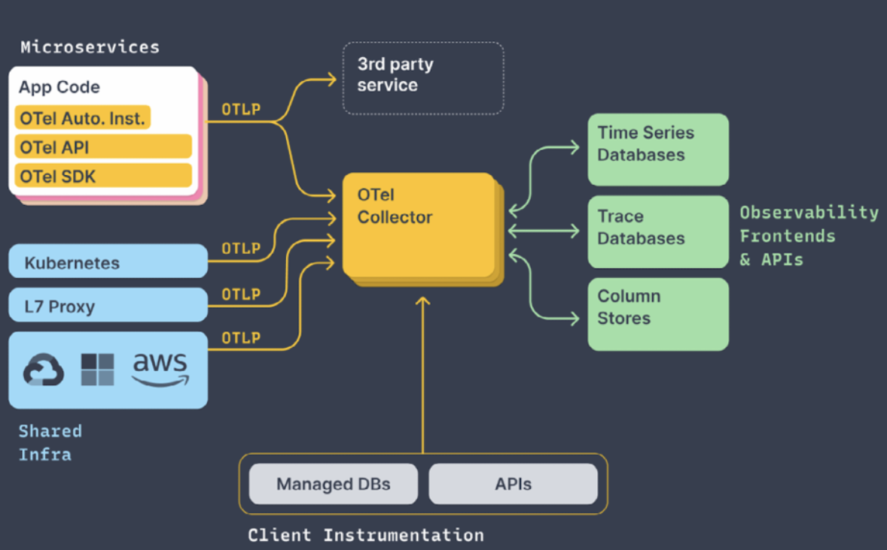

# OpenTelemetry란?
Trace, Metric, Log 같은 데이터를 instrumenting, generating, collecting, exporting하는 Observability framework이다. OTel은 상용 서비스 또는 Jaeger, Prometheus, Grafana와 같은 오픈소스 백엔드로 데이터를 전송하여 데이터를 저장하고, trace, metric, log 데이터를 저장하거나 쿼리할 수 있는 방법을 제공하지는 않는다.

 
 
# OTel 아키텍처 및 구성 요소
개발 연어별 SDK, 데이터 수집, 변환 및 데이터 내보내기, 자동 계측 패키지를 포함한 여러 구성 요소로 구성된다. 아래 그림은 오픈텔레메트리의 아키텍처와 구성요소를 나타낸 그림이다.


 
## 구성 요소

- 신호: 로그, 메트릭, 추적에 대한 기술적인 스펙을 정의
  - 구성
    - 데이터 모델
    - API
    - SDK
    - 계측 라이브러리
    - 리소스
    - 배기지
    - 이벤트
    - 링크
- 콘텍스트 전파: 다양한 스트림 간에 문맥을 전달하는 과정을 의미하고, 이를 통해 사용자 정의값(배기지) 전파가 가능
  - 추적 콘텍스트를 전파하려면 오픈텔레메트리 API에 전파자를 등록해야 함
- 파이프라인: OTel에서 컬렉터를 구현하는 구체적인 방법을 설명
  - otel 파이프라인 아키텍처
    - 1) 프로바이더: 텔레메트리 데이터를 생성하기 전 애플리케이션 코드를 초기에 구성해야 함
    - 2) 텔레메트리 생성기
      - 프로바이더가 인스턴스화한 텔레메트리 생성기를 SDK에서 사용할 수 있음
      - 텔레메트리 생성기를 인스턴스화할 때 애플리케이션과 계측 라이브러리는 프로바이더에게 이름을 전달해야 함
    - 3) 프로세서
      - 텔레메트리 데이터가 생성되면 프로세스는 데이터 내용을 추가로 수정할 수 있는 기능을 제공
    - 4) 익스포터
      - 오픈텔레메트리의 내부 데이터 모델을 구성된 익스포터와 가장 일치하는 형식으로 변환

 
# OTel collector
메트릭, 추적, 로그를 수신, 처리 후에 오텔 백엔드로 데이터를 내보내는 방법을 제공한다. OTel의 구성은 Receivers, processors, exporters 세 가지로 구성된다.

OpenTelemetry docs


- Receivers: 프로토콜을 통해 데이터를 수신받을 수 있고, 오텔 컬렉터는 다양한 receivers를 제공한다.
- Processors: 수신한 데이터를 백엔드로 보내기 전 데이터를 변경할 수 있다.
- Exporters: 데이터를 하나 이상의 오텔 백엔드로 보내는 방법이다.

컬렉터를 사용해 아래와 같이 데이터 파이프라인 YAML을 구성할 수 있다. 

```
receivers:
  jaeger:
    protocols:
      thrift_http:
exporters:
  otlp:
    endpoint: tempo:4317
    insecure: true
service:
  pipelines:
    traces:
      receivers: [jeager]
      exporters: [otlp]
```
 
# OpenTelemetry Demo

GitHub - open-telemetry/opentelemetry-demo: This repository contains the OpenTelemetry Astronomy Shop, a microservice-based dist
This repository contains the OpenTelemetry Astronomy Shop, a microservice-based distributed system intended to illustrate the implementation of OpenTelemetry in a near real-world environment. - ope...
github.com


 
책에 있는 데모 대신 위의 깃허브 데모를 간단히 알아보겠습니다. 도커와 쿠버네티스로 데모를 실행할 수 있는데 저는 쿠버네티스로 데모를 실행하는 것에 대해 알아봤습니다.
 
1. 데모 실행

````
# helm 사용한 설치
helm repo add open-telemetry https://open-telemetry.github.io/opentelemetry-helm-charts
helm install my-otel-demo open-telemetry/opentelemetry-demo
kubectl apply --namespace otel-demo -f https://raw.githubusercontent.com/open-telemetry/opentelemetry-demo/main/kubernetes/opentelemetry-demo.yaml
# 포트포워딩
kubectl port-forward svc/my-otel-demo-frontendproxy 8080:8080
````
 
2. 인그레스를 사용해 데모 구성 요소 노출

```
components:
  frontendProxy:
    ingress:
      enabled: true
      annotations: {}
      hosts:
        - host: otel-demo.my-domain.com
          paths:
            - path: /
              pathType: Prefix
              port: 8080
```
 
3. 콜렉터 구성하기

```
opentelemetry-collector:
  config:
    exporters:
      otlphttp/example:
        endpoint: <your-endpoint-url>

    service:
      pipelines:
        traces:
          exporters: [spanmetrics, otlphttp/example]
```
 
4. 사용자 정의 파일로 helm 차트 설치

```
helm install my-otel-demo open-telemetry/opentelemetry-demo --values my-values-file.yaml
```            

출처: https://youjava.tistory.com/54 [Software Engineer가 될래요:티스토리]