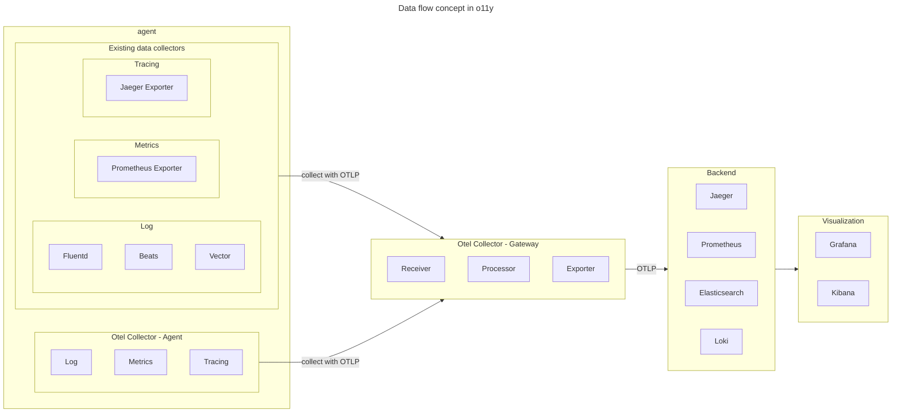

# Understand how complicated it is to integrate o11y

## Components

### Backend / Visualization

- Jaeger
  - Distributed tracing
- Prometheus
  - Metrics
- Elasticsearch/Loki
  - Logs
- Grafana/Kibana
  - Visualization

### Data collector

- Existing data collector

  - Log : Fluentd, Beats, Vector
  - Metrics : Prometheus Exporter
  - Tracing : Jaeger Exporter

- OpenTelemetry Collector
  - for distirbuted tracing, metrics and logs
  - Integrates collection of telemetry data sources
  - Available as a `agent` and also as a `gateway`

## Is Otel necessary in O11y?

- OpenTelemetry components are for standardized pipeline(with OTLP).
- Otel can integrate multiple data types and standardize them with equal time window.
- Otel can inject to multiple backends like Jaeger, Prometheus, Elasticsearch, etc..
- But if the size of existing system is not big, Meeting the statements and time window in existing system is enough for observability.

## Applicability

### Auto instrumentation

Basically, the tracing tool can extract the information with `trace_id` and `span_id` from the request header and response header. So, the auto instrumentation is possible with the following conditions.

Also logs are extracted from the `server things` when events are occurred.

Metrics are extracted from the specific interface of the application.

### Manual instrumentation

Some applications are difficult to apply auto instrumentation.
In this case, manual instrumentation is needed.
